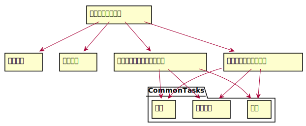

# 项目开发计划

## 1.引言

### 1.1 编写目的

编写此软件计划的目的主要是以文件的形式对系统的开发做规划和安排，文档中会对整个项目开发过程中的工作内容流程、团队组织结构、开发进度、经费预算、内外条件需求、技术方法等做规划和说明，便于团队成员更好地了解项目情况、明确职责、合理开发各阶段各项任务、按时保质完成开发。项目开发计划是团队成员之间的共识和约定，也是项目生命周期内的所有项目活动的行动基础、项目团队开展和检查项目工作的依据。

### 1.2 参考资料

待定（欢迎添加

## 2.项目概述

### 2.1 项目目标与工作内容

本项目的目标是开发一个礼让行人的车辆预警系统，给驾驶员良好的出行体验，不必被复杂的交通规则所困扰。工作内容包括以下几个部分：

1.项目可行性分析；

2.项目体系结构设计；

3.项目编程实现；

4.项目测试与发布；

5.项目后期管理与维护；

### 2.2 团队组织结构

团队基本信息：

|              部分              |   负责成员   |
| :----------------------------: | :----------: |
|  摄像头硬件调试、图像信息获取  | 罗铨、曹梦奇 |
| 行进信息分析、行道线与行人检测 | 罗铨、曹梦奇 |
|          礼让行人分析          | 罗铨、曹梦奇 |

团队组织结构：

各团队成员根据子系统的分解，合作完成各个子系统。高层次分析设计完成之后，进行细致的分析、测试、实现、发布等工作。

### 2.3 产品

#### 2.3.1 程序

程序名称：礼让行人的预警系统

编程语言：待定

###2.4 验收标准

系统正常运行，程序实现预期功能。

### 2.5 项目的计划完成时间和最迟期限

项目进度表：

|   进度标题   |                   进度内容                   |      时间       |
| :----------: | :------------------------------------------: | :-------------: |
| 项目准备阶段 | 可行性研究、项目开发计划、风险列表及设备购买 | 18.3.16-18.5.16 |
| 项目执行前期 |                设备安装与调试                | 18.6.1-18.6.30  |
| 项目执行中期 |              算法实现，数据采集              | 18.7.1-18.11.30 |
| 项目执行后期 |              算法优化，车辆测试              | 18.12.1-19.1.30 |
| 项目执行末期 |           根据研究结果撰写结题报告           | 19.2.1-19.2.28  |

## 3.实施计划

### 3.1 工作任务的分解与人员分工

工作分解结构：[工作分解结构](https://github.com/CV-PrewarningSystem/CV/blob/master/DOC/%E9%A1%B9%E7%9B%AE%E5%BC%80%E5%8F%91%E8%AE%A1%E5%88%92.svg)

各个子系统的开发成员：

|     子系统名称     |     成员     |
| :----------------: | :----------: |
| 图像分析与行人检测 | 曹梦奇／罗铨 |
|   行人分析与预警   | 曹梦奇／罗铨 |

### 3.2 预算

1. 参与开发的人员数量：2人

2. 预计所需时间：约1年
3. 经费预算：[投资与收益分析](https://github.com/CV-PrewarningSystem/CV/blob/master/DOC/%E5%8F%AF%E8%A1%8C%E6%80%A7%E5%88%86%E6%9E%90.md#6%E6%8A%95%E8%B5%84%E5%8F%8A%E6%95%88%E7%9B%8A%E5%88%86%E6%9E%90)

### 3.3 关键问题

1. 预警实现的实时性问题
   * 影响：如果实时性没有得到保证，将无法得到有效的预警信号；
2. 图像获取的精确性问题
   * 影响：若图像获取不能满足条件，将无法得到有效的行人检测结果；
3. 开发过程中的计划、沟通和技术限制等
   * 影响：耽误开发进度、延长开发时间、无法达到预期目标。

## 4.技术流程计划

### 4.1 技术标准

待定（欢迎添加

###4.2 技术要求

待定（欢迎添加

