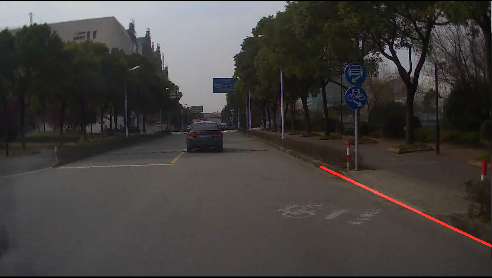
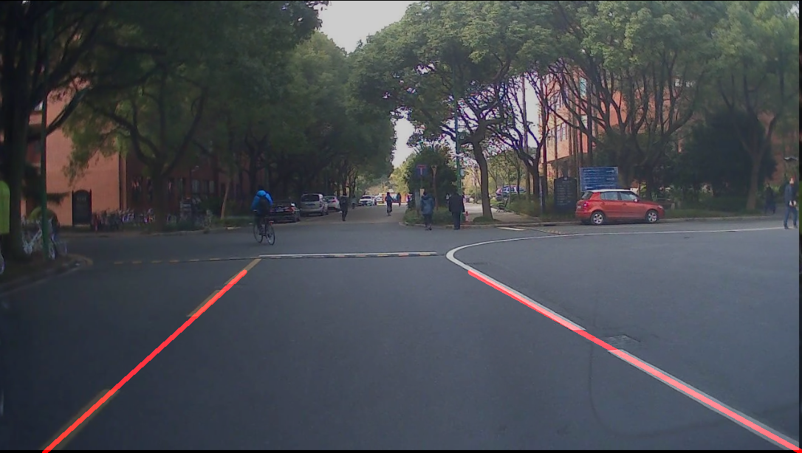
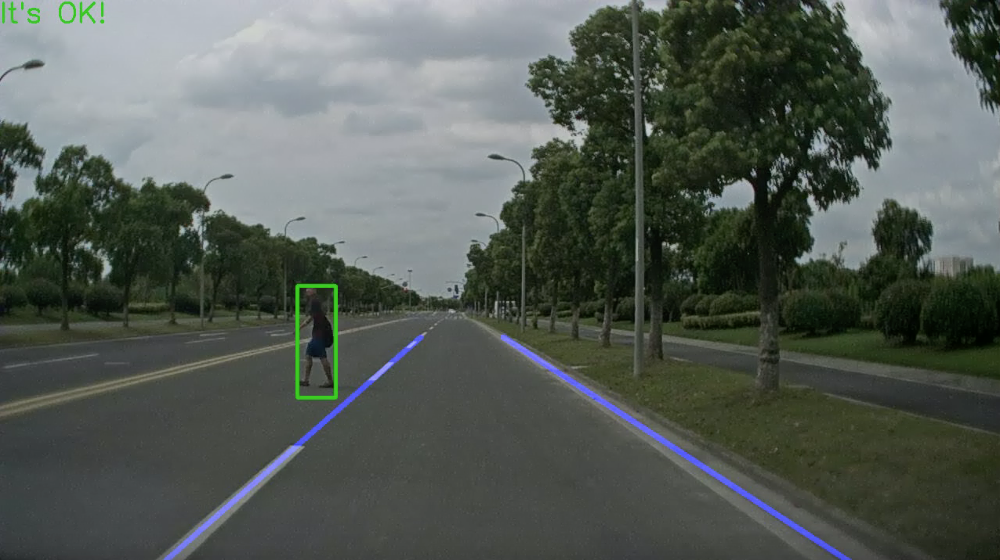

# Traffic-Courtesy for Pedestrian
> Environment：Ubuntu 16.04 & OpenCV 3.4.1  & Python 3
>

### 1.LaneLine Detection Based on Hough & Canny

By using Canny, we get the edge of a graph. However, we find the result awful because of  lightness, contrast ratio and so on. Thus we use the procedure below to modify the picture and as we expect, getting a better result.

* Using Color-Enhancement to get lane line distinguished in the picture
* Using Gaussian-Blur to get a smoother edge making Canny softer and more accurate

After we get the edge of the graph, we use Hough Line Detection to get the line in the graph. In order to avoid the noise, we add multiple filters in it.

* Using the norm of the line and the angle of the line
* Adding three different ROIs in order to deal with different kinds of roads

Other trials but not accepted:

* OTSU Method of Thresholding
  * It 's good if the quality of the graph is OK but at some dark places, it has a really awful result. All the lane lines are ignored because of thresholding
* Sobel Instead of Canny
  * Frankly speaking it is as good as Canny. But in Sobel you have to calculate x-direction and y-direction by yourself and use it into your algorithm
* HLS & HSV Color Space Thresholding
  * HLS and HSV thresholding bring a lot of noise. Also, the threshold is hard to decide for a better result. LUV Space and others are the same
* Equalizing Histogram to Get Obvious Lines
  * Actually it brings a lot of noise when the ground is not so smooth. Thus it brings bad lines and edges after Canny & Hough

### 2.Pedestrian Detection Based on YOLOv3

We've tried HoG & SVM for the sake of faster and easier detection. However the result is not satisfied and we have to turn to deep learning framework. Since we need faster and real-time detection, we choose to use YOLO as our pedestrian detection.

We also do some refreshment on YOLO. Implementing it by Keras with tensorflow backend makes us attachable to its base. We've done neural network pruning and weight clustering to YOLO in order to make it faster and meet our need. The YOLO pruning and weight clustering Github Repo is here: [YOLOPruning&WeightClustering](https://github.com/CHOcho-quan/YOLOv3-Compression)

